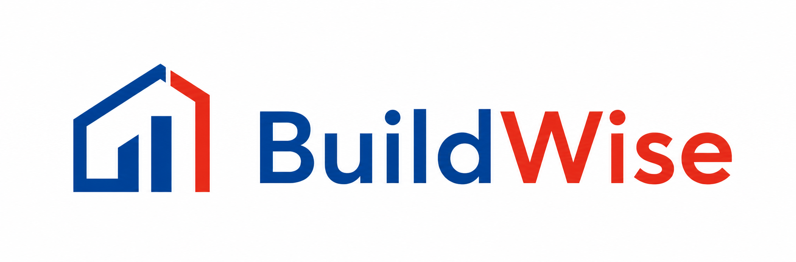

<p align="center">
  
</p>

# BuildWise

BuildWise es un sistema para analizar precios de materiales de construccion, proyectar su evolucion y apoyar decisiones de compra.

Hoy el proyecto cubre tres frentes:

- catalogo e historial de precios;
- forecasting de materiales;
- recomendaciones y optimizacion de compra.

## Que resuelve

Permite responder preguntas como:

- cuanto aumento un material;
- cuanto cuesta realmente por kg, unidad o metro;
- como evoluciono el precio en el tiempo;
- cuanto podria costar comprar ahora o despues;
- como asignar un presupuesto limitado entre materiales.

## Estado actual

El repositorio ya tiene:

- backend con FastAPI;
- base PostgreSQL con Docker;
- frontend web;
- autenticacion con roles;
- carga y consulta de precios historicos;
- normalizacion automatica de precios;
- graficos y filtros;
- forecast para materiales soportados;
- endpoints de recomendacion y optimizacion de compra.

## Levantar el proyecto

### 1. Configuracion local

```bash
cp .env.example .env
```

Completar en `.env`:

```env
OPENAI_API_KEY=replace-with-your-token
OPENAI_BASE_URL=https://ai.cloud.um.edu.ar/api/v1
OPENAI_MODEL=gemma4-26b
```

### 2. Ejecutar

```bash
docker compose up -d --build
```

### 3. URLs utiles

```text
Frontend: http://localhost:3000
API: http://localhost:8000
Swagger: http://localhost:8000/docs
```

### 4. Comandos rapidos

```bash
docker compose ps
docker compose down
```

## Usuarios de prueba

Admin:

```text
usuario: admin
clave: admin123
```

Cliente:

```text
usuario: cliente
clave: cliente123
```

## Stack

- Backend: FastAPI, SQLAlchemy, PostgreSQL, Alembic, Pydantic
- Frontend: React, Vite, Material UI, Tailwind CSS, Chart.js
- Infra local: Docker Compose

## Estructura principal

```text
app/
  modules/
    auth/
    catalog/
    pricing/
    health/
  shared/
  operations/

frontend/
docs/
db/
tests/
```

## Arquitectura

El backend sigue un monolito modular con capas:

- `domain`: reglas de negocio;
- `application`: casos de uso;
- `infrastructure`: persistencia y adaptadores tecnicos;
- `interfaces`: rutas HTTP y schemas.

Dependencias esperadas:

```text
interfaces -> application -> domain
infrastructure -> application/domain
```

## Forecasting

El foco metodologico principal esta en `Cemento Portland`.

Puntos importantes:

- la variable objetivo es `precio_promedio_normalizado`;
- la metrica principal es `MAPE`;
- no se elige modelo por grafica visual;
- `Cemento Portland` es la serie mas fuerte metodologicamente;
- `Pastina` y `Membrana Megaflex` usan series mas hibridas.

Estado resumido:

- baseline productivo vigente para cemento: `prophet_ipim_nivel_general`;
- mejor candidata experimental actual: `prophet_ipim_icc_var_materials`;
- segunda mejor candidata experimental: `prophet_ipim_cac_var_materials`.
- `Pastina` y `Membrana Megaflex` ya pasaron por la misma bateria experimental profunda.

Mejores estimaciones hoy:

- `Cemento Portland`
  - `3m`: `ensemble_simple_top2`
  - mejor candidata por regresores: `prophet_ipim_icc_var_materials`
- `Pastina`
  - `3m`: `prophet_ipim_nivel_general_lags`
  - `6m`: `ensemble_simple_top2`
  - `12m`: `prophet_ipim_cac_var_materials`
- `Membrana Megaflex`
  - `3m`: `prophet_ipim_nivel_general_lags`
  - `6m`: `prophet_ipim_nivel_general_lags`
  - `12m`: `prophet_mayorista`

Detalle completo:

- [docs/MEDICIONES_FORECASTING.md](docs/MEDICIONES_FORECASTING.md)
- [docs/DECISIONES_TESIS.md](docs/DECISIONES_TESIS.md)

## Optimizacion de compras

La epica de optimizacion ya tiene backend implementado para:

- recomendacion de momento de compra;
- comparacion de estrategias;
- optimizacion con restriccion presupuestaria;
- priorizacion de materiales criticos.

La optimizacion bajo presupuesto usa `PuLP`.

Detalle metodologico:

- [docs/HU/DISENO_EPICA_5.md](docs/HU/DISENO_EPICA_5.md)

## Bootstrap y reproducibilidad

La prioridad actual del proyecto es cerrar un entorno reproducible de tesis con un dataset minimo gobernado desde el repo.

El flujo objetivo de bootstrap es:

```bash
make bootstrap-all
```

Ese flujo debe dejar cargados:

- `Cemento Portland`;
- `Pastina`;
- `Membrana Megaflex`;
- regresores base como `ipc`, `dolar_*` e `ipim_nivel_general`.

La fuente canonica de cemento es:

- `db/bootstrap/cemento_portland_historico.csv`

Importador oficial:

- `app/operations/bootstrap/import_cemento_canonico.py`

## Endpoints utiles

Autenticacion:

```http
POST /auth/login
GET /auth/me
```

Catalogo:

```http
GET /materiales
GET /presentaciones
GET /fuentes
```

Precios:

```http
GET /precios-historicos
POST /precios-historicos
GET /materiales/{material_id}/precios
GET /materiales/{material_id}/serie-precios
```

## Migraciones y tests

Migraciones:

```bash
.venv/bin/python -m alembic upgrade head
.venv/bin/python -m alembic current
.venv/bin/python -m alembic check
```

Tests:

```bash
.venv/bin/python -m pytest -q
```

## Documentacion

- [docs/MEDICIONES_FORECASTING.md](docs/MEDICIONES_FORECASTING.md): metricas, backtesting y comparativas
- [docs/DECISIONES_TESIS.md](docs/DECISIONES_TESIS.md): decisiones metodologicas
- [docs/HU/HU.md](docs/HU/HU.md): historias de usuario y estado funcional
- [docs/HU/DISENO_EPICA_1.md](docs/HU/DISENO_EPICA_1.md): gestion y preparacion de datos
- [docs/HU/DISENO_EPICA_2.md](docs/HU/DISENO_EPICA_2.md): analisis y visualizacion
- [docs/HU/DISENO_EPICA_3.md](docs/HU/DISENO_EPICA_3.md): prediccion de precios
- [docs/HU/DISENO_EPICA_4.md](docs/HU/DISENO_EPICA_4.md): proyeccion de costos de obra
- [docs/HU/DISENO_EPICA_5.md](docs/HU/DISENO_EPICA_5.md): optimizacion de compras
- [docs/HU/DISENO_EPICA_6.md](docs/HU/DISENO_EPICA_6.md): asistencia conversacional
- [docs/DISENO_SELECTOR_MODELOS.md](docs/DISENO_SELECTOR_MODELOS.md): seleccion de modelos
- [docs/DISENO_INTEGRACION_SELECTOR_FORECAST.md](docs/DISENO_INTEGRACION_SELECTOR_FORECAST.md): integracion futura del selector
- [docs/TESIS_BORRADOR.md](docs/TESIS_BORRADOR.md): redaccion de tesis en curso

## Nota de alcance

El `README` queda intencionalmente corto. La idea es que sirva para entender rapido:

- que hace el proyecto;
- como levantarlo;
- donde esta el estado real;
- y en que documento profundizar cada tema.
