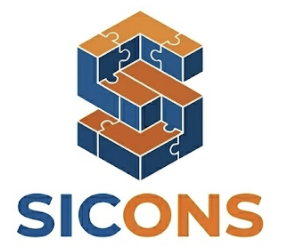

<p align="center">
  
</p>

# SICONS

SICONS es un sistema de apoyo a la toma de decisiones para la compra de materiales de construccion.

La idea no es solo guardar precios, sino ayudar a responder preguntas concretas:

- cuanto aumento un material
- como comparar precios cuando cambia la presentacion
- cuanto cuesta realmente por kg, metro o unidad
- como evoluciono el precio en el tiempo
- que impacto podria tener comprar ahora o mas adelante

El foco principal esta en el comprador de materiales. El administrador existe para mantener la base de datos limpia y confiable.

## Estado actual

El proyecto ya tiene:

- backend con FastAPI
- base PostgreSQL con Docker
- migraciones con Alembic
- frontend web
- login con roles
- carga de precios historicos solo para admin
- consulta de historial para cliente y admin
- normalizacion automatica de precios
- grafico historico
- filtros por material y periodo
- datos reales de cemento

## Demo local

Levantar todo:

```bash
cp .env.example .env
docker compose up -d --build
```

URLs principales:

```text
Frontend: http://localhost:3000
API:      http://localhost:8000
Swagger:  http://localhost:8000/docs
```

Ver estado de los servicios:

```bash
docker compose ps
```

Apagar:

```bash
docker compose down
```

## Usuarios de prueba

Admin:

```text
usuario: admin
clave:   admin123
```

Puede:

- consultar historial
- ver graficos
- filtrar datos
- registrar precios historicos

Cliente:

```text
usuario: cliente
clave:   cliente123
```

Puede:

- consultar historial
- ver graficos
- filtrar datos
- analizar variaciones

No puede cargar precios.

## Stack

Backend:

- FastAPI
- SQLAlchemy
- PostgreSQL
- Alembic
- Pydantic

Frontend:

- HTML
- CSS
- JavaScript
- Chart.js
- Nginx

Infra local:

- Docker Compose

## Conceptos principales

### Material

Representa el producto que se quiere analizar.

Ejemplos:

- Cemento Portland
- Pastina Klaukol

### Presentacion

Representa como se vende un material.

Ejemplos:

- Bolsa 25 kg
- Bolsa 50 kg
- Cano 3 m

### Precio historico

Guarda el precio real de un material en una fecha determinada.

Incluye:

- material
- presentacion
- fuente
- fecha
- precio original
- precio normalizado
- comprobante
- observaciones

### Normalizacion

La normalizacion permite comparar precios aunque cambie la presentacion comercial.

Ejemplo:

```text
Bolsa 25 kg = $ 6.250
Precio normalizado = 6.250 / 25 = $ 250 por kg
```

Asi se puede comparar contra una bolsa de 50 kg o contra cualquier otra presentacion.

## Endpoints utiles

Login:

```http
POST /auth/login
GET  /auth/me
```

Catalogos:

```http
GET  /materiales
GET  /presentaciones
GET  /fuentes
```

Precios:

```http
GET  /precios-historicos
POST /precios-historicos
GET  /materiales/{material_id}/precios
GET  /materiales/{material_id}/serie-precios
```

Serie historica del cemento:

```bash
curl "http://localhost:8000/materiales/1/serie-precios?desde=2025-07-01&hasta=2026-03-31"
```

## Migraciones

Aplicar migraciones:

```bash
.venv/bin/python -m alembic upgrade head
```

Ver revision actual:

```bash
.venv/bin/python -m alembic current
```

Validar modelos contra migraciones:

```bash
.venv/bin/python -m alembic check
```

## Tests

Ejecutar tests:

```bash
.venv/bin/python -m pytest -q
```

## Estructura

```text
app/
├── api/              Endpoints y dependencias HTTP
├── core/             Configuracion y seguridad
├── db/               Sesion, seed e importadores
├── models/           Modelos SQLAlchemy
├── schemas/          Schemas Pydantic
├── services/         Logica de negocio
└── main.py           App FastAPI
```

```text
frontend/
├── index.html
├── styles.css
├── app.js
├── logo.png
├── pestana.png
├── Dockerfile
└── nginx.conf
```

```text
db/
├── migrations/
└── seed/
```

## Vision del producto

SICONS apunta a convertirse en una herramienta de inteligencia de compras para obras chicas y medianas.

La evolucion natural del proyecto es:

1. ordenar datos historicos
2. normalizar precios
3. analizar variaciones
4. predecir precios futuros
5. estimar impacto economico
6. comparar comprar ahora contra comprar despues

En una frase:

```text
SICONS ayuda a anticipar aumentos de materiales y decidir mejor cuando comprar.
```
